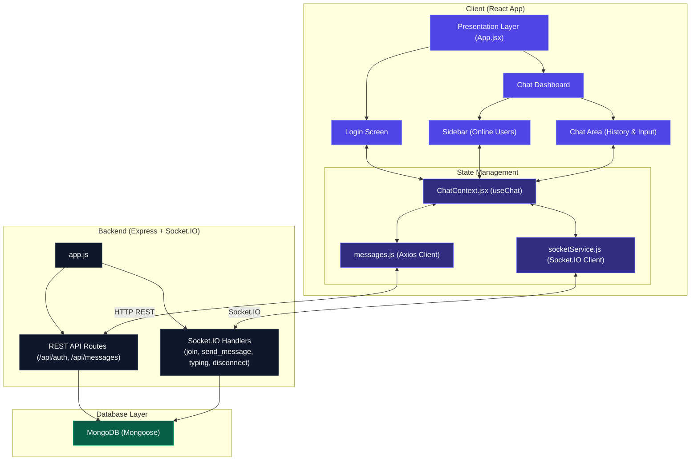

# Chatrix 💬

Chatrix is a real-time messaging web application featuring a sleek glassmorphic user interface. It is built using Node.js, Express, and Socket.io on the backend, and React with Tailwind CSS v4 on the frontend. The application features dummy session login, live online user lists, real-time message broadcasting, typing indicators, and a persistent chat history stored in MongoDB.

---

## 🌐 Live Deployments

* **Frontend (Vercel):** [https://chatrix-ss.vercel.app/](https://chatrix-ss.vercel.app/)
* **Backend API (Render):** [https://chatrix-yooz.onrender.com/](https://chatrix-yooz.onrender.com/)

---

## 🚀 Features

- **Real-Time Communication**: Seamless chat message delivery without page reloads using Socket.io.
- **Session Authentication**: Fast, username-based login session stored locally to automatically resume on return.
- **Live User Presence**: Sidebar displaying all online users with active indicators that sync and broadcast automatically when users join or disconnect.
- **Typing Indicators**: Visual cues (e.g. *"Alice and Bob are typing..."*) shown when other users are active in the input box.
- **Glassmorphic Styling**: Sleek card layout, dark mode aesthetic (`bg-slate-950`), custom scroll bars, and gradient text animations built using Tailwind CSS v4.
- **Persistent History**: Chronological chat history saved in MongoDB and loaded automatically upon login.

---

## 🛠️ Tech Stack

### Frontend
- **Framework**: React 19 (Vite)
- **Styling**: Tailwind CSS v4 (using `@tailwindcss/vite` configuration)
- **State Management**: React Context API
- **Real-time Client**: Socket.io Client
- **Icons**: React Icons (Fi icons)
- **HTTP Client**: Axios

### Backend
- **Runtime**: Node.js
- **Framework**: Express.js
- **Real-time Server**: Socket.io
- **Database ORM**: Mongoose (MongoDB)
- **Process Manager**: Nodemon

---

## 📁 Project Structure

```
chatrix/
├── client/                 # Frontend React Application
│   ├── src/
│   │   ├── api/            # API endpoints (Axios calls)
│   │   ├── components/     # UI Views & modular layouts (Sidebar, ChatArea, etc.)
│   │   ├── context/        # ChatContext (global socket, session, and message state)
│   │   ├── socket/         # Socket.io connection setup
│   │   ├── App.jsx         # App router (authenticates and switches screens)
│   │   ├── index.css       # Core stylesheets & Tailwind imports
│   │   └── main.jsx        # Root entry point
│   ├── vite.config.js      # Vite compilation configuration
│   └── package.json
│
├── server/                 # Backend Node.js Server
│   ├── config/             # Database connection setup
│   ├── controllers/        # Express route business logic
│   ├── middleware/         # Custom Express error middlewares
│   ├── models/             # Mongoose schemas (User, Message)
│   ├── routes/             # Express routes (auth and message logs)
│   ├── sockets/            # Socket.io handlers (typing, presence, messages)
│   ├── app.js              # Application bootstrapper
│   ├── package.json
│   └── .env                # Server environment configuration
└── REQUIREMENT.md          # Original requirements document
```

---

## 🏗️ Architecture



## ⚙️ Environment Variables

### Backend Configuration
Create a `.env` file inside the `server/` directory:
```env
PORT=3000
MONGODB_URI=mongodb+srv://<username>:<password>@cluster0.mongodb.net/chat-app?retryWrites=true&w=majority
CORS_ORIGIN=http://localhost:5173,http://localhost:5174,http://localhost:5175
```

### Frontend Configuration
By default, the client points to `http://localhost:3000` for both APIs and Sockets. If you change your backend port or deploy to a hosting platform, you can configure these environment variables in a `.env` file inside the `client/` directory:
```env
VITE_API_URL=http://localhost:3000
VITE_SOCKET_URL=http://localhost:3000
```

---

## 💻 Installation & Setup

### Prerequisites
Make sure you have [Node.js](https://nodejs.org/) installed and a running instance of [MongoDB](https://www.mongodb.com/) (either locally or on MongoDB Atlas).

---

### Step 1: Run the Backend Server
1. Navigate to the server folder:
   ```bash
   cd server
   ```
2. Install the server dependencies:
   ```bash
   npm install
   ```
3. Start the server in development mode (runs on port `3000`):
   ```bash
   npm run dev
   ```

---

### Step 2: Run the Frontend Client
1. Open a new terminal window and navigate to the client folder:
   ```bash
   cd client
   ```
2. Install the client dependencies:
   ```bash
   npm install
   ```
3. Start the frontend development server (Vite):
   ```bash
   npm run dev
   ```
4. Click the link shown in your terminal (usually `http://localhost:5173` or `http://localhost:5174`) to launch Chatrix in your browser.

---

## 🧠 Design Decisions & Architecture

1. **Context-Driven State Layer**:
   All state logic (Socket listeners, connection indicators, online users, active session triggers, typing timeouts, and history arrays) is consolidated in `ChatContext.jsx`. This isolates application state from render views, resulting in a cleaner UI layout and easier logic testing.
   
2. **Modular View Component Structure**:
   `App.jsx` acts purely as a shell containing conditional routes (Login vs. Dashboard). Layout grids, sidebars, typing indicators, and individual message boxes are broken out into separate files inside `/client/src/components` to enforce readability and maintainability.

3. **Robust WebSocket Lifecycle Hook**:
   Socket listener binds are handled inside a single React `useEffect`. When connections drop or the server undergoes hot-reloading:
   - The client automatically re-establishes a connection.
   - The connection listener re-triggers the `'join'` event to register presence with the new server instance immediately.

4. **Multiple Localhost CORS Support**:
   The backend server parses multiple local ports (ports `5173`, `5174`, `5175`) from a comma-separated CORS configuration. This prevents CORS preflight blocks if Vite launches on a fallback port.

---

## 💡 Assumptions Made

- **Session Security**: Username authentication is a dummy login to quickly verify user identity. Password check is assumed out of scope for this design version.
- **Single Room Context**: All users register under the same `#general-chat` channel. Future room creations can be supported by adjusting the `join` socket schema.
- **MongoDB Connection**: The server connects to MongoDB using the `MONGODB_URI` environment variable. Ensure your database (local or Atlas cluster) is running and accessible before launching the server.

---

## 👤 Developer

*   **Sahil Sameer** - [GitHub](https://github.com/SahilSameer18)